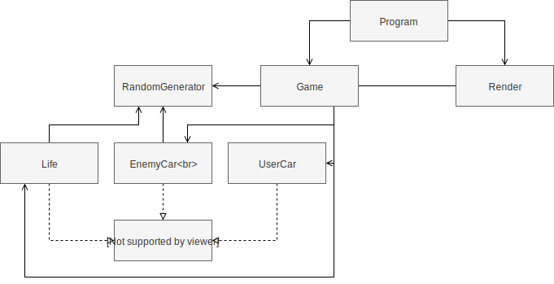
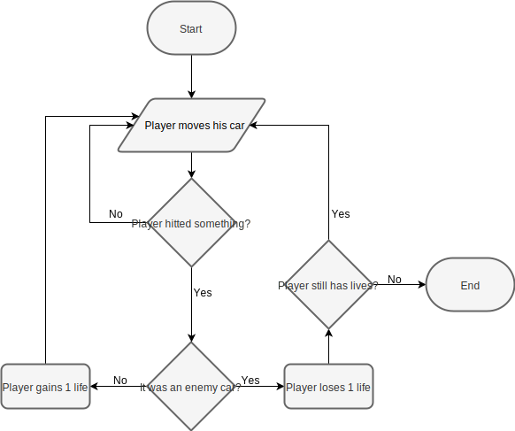

# 2º Projeto de Linguagens de Programação II

###### Projeto realizado por:
Joana Marques a21701929 <p>
Pedro Santos a21702907

##### Link do repositório GitHub : https://github.com/pedrosantosobral/LP2_P2

### Relatório:
Pedro: <p>
- Fez a interface `IGameObject` e a classe `Life`; <p>
- Criou as primeiras variáveis e fez o spawn aleatório de objetos na classe `Game`; <p>
- Adicionou as colisões na classe `Game`; <p>
- Fez alguns métodos para imprimir as informações na classe `Render`; <p>
- Fez a classe `RandomGenerator`; <p>
- Fez o UML. <p>


Joana: <p>
- Fez as classes `EnemyCar` e `UserCar`; <p>
- Fez o movimentos dos objetos na classe `Game`; <p>
- Adiconou a classe `Render` com os métodos principais para escrever as informações do jogo no ecrã; <p>
- Fez o menu inicial na classe `Render`; <p>
- Fez a classe `Program`; <p>
- Fez o Fluxograma. <p>

O relatório foi feito por todos os elementos do grupo.

### Solução:
##### Arquitetura:
Separámos o código em várias classes.
Cada classe desepenha uma determinada função no código. <p>
O `Program` inicializa o jogo. <p>
A classe `Game` tem o funcionamento do jogo em si. <p>
A interface `IGameObject` contém o método update a ser implementado pelos objetos que vão implementar esta interface. <p>
A classe `EnemyCar` contém as informações sobre os carros inimigos e o seu método Update. <p>
A classe `Life` contém as informações sobre as vidas extra que o jogador pode apanhar e o seu método Update. <p>
A classe `UserCar` contém as informações sobre o carro do jogador, o seu método Update e recebe o input dado pelo jogador. <p>
A classe `Render` é onde mandamos imprimir o jogo e as suas informações no ecrã. <p>
A classe `RandomGenerator` calcula a probabilidade de um objeto fazer spawn e a sua posição ao longo de x.


Um dos algoritmos que usámos foi para verificar as colisões dos carros dos inimigos com o carro do jogador, fazendo o jogador perder uma vida. 
```cs
if (tempC.posY == userCar.posY && tempC.posX == userCar.posX)
{
    totalLives--;
    hitted = true;
    speed += 20;
}
```
Nesta parte do código, temos a colisão do carro do jogador com uma vida extra.
```cs
if (tempL.posY == userCar.posY && tempL.posX == userCar.posX)
{
    totalLives++;
}
```

##### Diagrama UML:

##### Fluxograma:


### Conclusões
Com este trabalho aprendemos mais sobre o Update method e o Game Loop.
Achamos que implementar o Update method foi o mais difícil de fazer.

### Referências
* Discussão sobre o projeto com alguns colegas de turma.
* [Console.KeyAvailable](https://docs.microsoft.com/en-us/dotnet/api/system.console.keyavailable?view=netframework-4.7.2)
* [Console.SetCursorPosition](https://docs.microsoft.com/en-us/dotnet/api/system.console.setcursorposition?view=netframework-4.7.2)
* [Games](https://github.com/NikolayIT/CSharpConsoleGames)
* [Cars](https://www.youtube.com/watch?v=VRABXEQvOXk)
